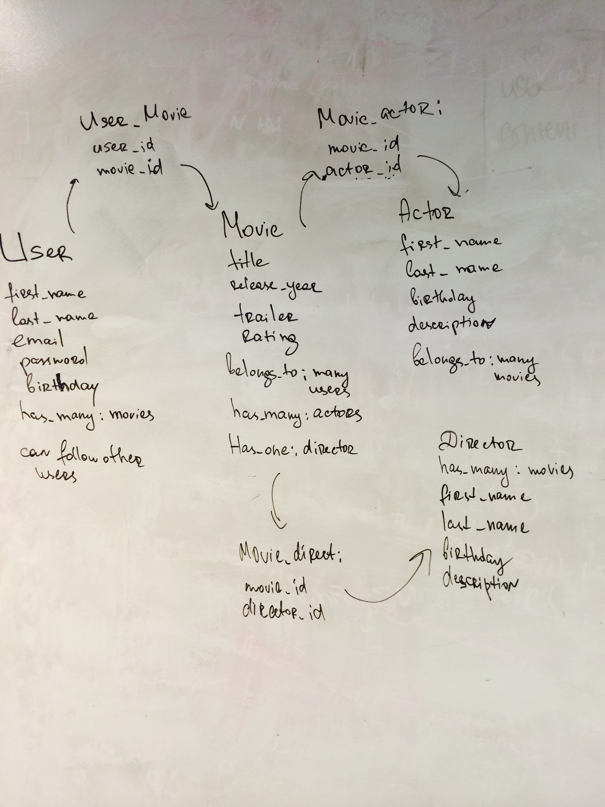

1. Create home page
  * Search bar
  * search movies by title(use OMDB api)
2. Results page
  * show results that match user's input
3. User can sign up
4. User can log in
5. User can log out
6. User has a profile
7. User has list of movies that he/she has watched

